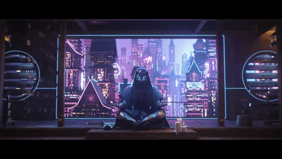

<!--
**KKA11010/KKA11010** is a ✨ _special_ ✨ repository because its `README.md` (this file) appears on your GitHub profile.

Here are some ideas to get you started:

- 🔭 I’m currently working on ...
- 🌱 I’m currently learning ...
- 👯 I’m looking to collaborate on ...
- 🤔 I’m looking for help with ...
- 💬 Ask me about ...
- 📫 How to reach me: ...
- 😄 Pronouns: ...
- ⚡ Fun fact: ...
-->

# Hello world!  I'm Agron.

 
Gif by [wizardsmagic](https://giphy.com/gifs/wizardsmagic-mtgneon-kamigawa-neon-dynasty-IYQutUaiLHTxmscCLy)

## 💻 My Tech Stack:

## 💬 About me

I'm passionate about many creative pursuits, including drawings, music, videography, building FPV racing drones, and of course, coding. I spend the most of my time developing software and reading documentations about the newest programming technologies. I love the fact that anyone can build anything without asking for permission. I find the open source community very interesting. It is diverse and highly motivated. Find me on [Nostr](https://snort.social/p/npub1pp355axf69z8ndrz8zdnqa54s90e5xy737mwqk9e9cvt606nwszsdx8nu7).

<!--## 🔭 Current project

 I am currently maintaining [a mobile Cashu wallet for Android and iOS](https://github.com/cashubtc/eNuts). Cashu is Ecash for Bitcoin based on David Wagner's variant of Chaumian blinding. The token logic is based on [minicash](https://github.com/phyro/minicash) ([description](https://gist.github.com/phyro/935badc682057f418842c72961cf096c)) which implements a [Blind Diffie-Hellman Key Exchange](https://cypherpunks.venona.com/date/1996/03/msg01848.html) scheme written down [here](https://gist.github.com/RubenSomsen/be7a4760dd4596d06963d67baf140406). -->

